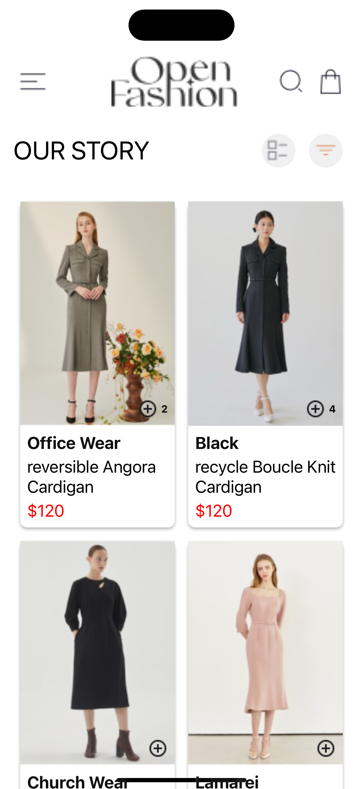
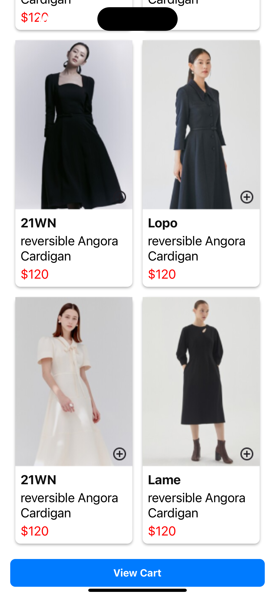
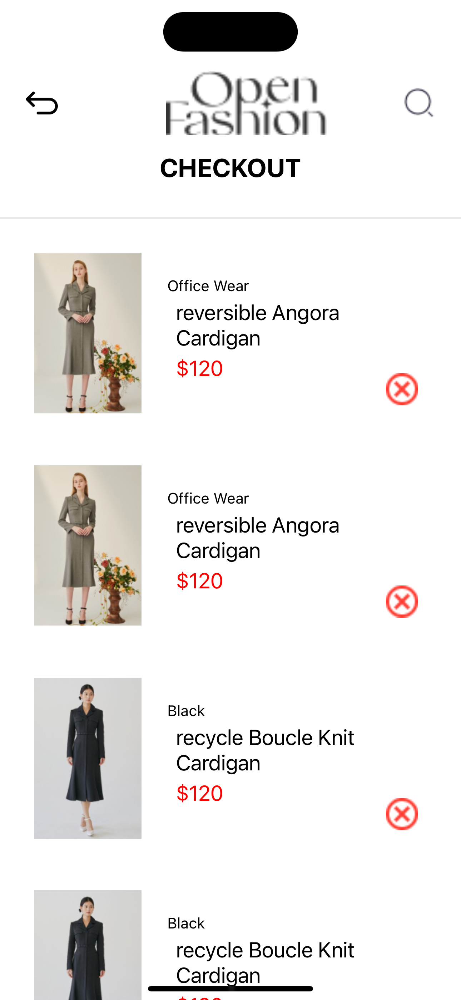
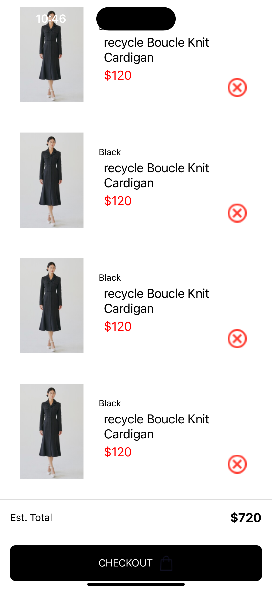

# rn-assignment6-10956133
rn-assignment6-10956133 project

ID: 11146109

React Native ShoppingApp App README
Design Choices
1. Overall Structure
The app is designed to showcase a simple e-commerce interface with two main screens: Home and Cart. The Home screen displays a grid of products in a two-column layout using FlatList and allows users to add items to their cart. The Cart screen displays the items added to the cart, allowing users to remove items and proceed to checkout.

2. UI/UX
a. Home Screen: Products are displayed in a grid format with each item showing the product image, category, name, and price. Users can add items to the cart by clicking on an "Add to Cart" button.

b. Cart Screen: Displays items added to the cart with their respective details (image, name, price). Users can remove items from the cart and see the total estimated price.

c. Navigation: Users can navigate between the Home and Cart screens using simple buttons (e.g., "View Cart" button on the Home screen, back button on the Cart screen).

3. AsyncStorage
a. Data Storage: Cart items are stored locally using AsyncStorage, a persistent key-value storage system provided by React Native. This allows items added to the cart to persist even if the app is closed and reopened.

Implementation:

When a user adds an item to the cart (addToCart function), the updated cart array is stored in AsyncStorage using setItem.
When a user removes an item from the cart (removeFromCart function), the updated cart array is stored in AsyncStorage.
On app load (useEffect hook), the cart data is fetched from AsyncStorage using getItem and displayed on both the Home and Cart screens.
Technologies Used
React Native: Used for building the cross-platform mobile app.
AsyncStorage: Used for local data persistence of cart items.
FlatList: Used for efficient rendering of lists and grids.
TouchableOpacity: Used for touchable components with visual feedback.
StyleSheet: Used for styling components using JavaScript objects.
Future Improvements
Authentication: Implement user authentication to allow for user-specific carts and orders.
Backend Integration: Connect the app to a backend server for real-time updates and data synchronization.
Enhanced UI: Improve the user interface with animations, transitions, and more detailed product information.

# rn-assignment6-10956133
# rn-assignment6-10956133
